# Contoso Ads on Containers

## Introduction
This sample demonstrates how ASP.NET Core 7.0 is used to build a cloud-native application 
that consists of a frontend web app and an API that communicate asynchronously via messaged 
queues. The messaging is implemented using Dapr and both frontend and API are hosted in Azure Container Apps.

## About
Contoso Ads on Containers is a modernized version of the original Contoso Ads sample app for 
[Azure Cloud Services](https://docs.microsoft.com/en-us/azure/cloud-services/cloud-services-dotnet-get-started) and 
[Azure WebJobs](https://docs.microsoft.com/en-us/azure/app-service-web/websites-dotnet-webjobs-sdk-get-started) built
from scratch for Azure Container Apps.

The repository consists of the following projects and folders:

* [src/ContosoAds.Web](src/ContosoAds.Web) - Contoso Ads ASP.NET Core Razor Pages web frontend. The UI shows a list of ads, and allows users to post, edit, and delete ads.
* [test/ContosoAds.Web.UnitTests](test/ContosoAds.Web.UnitTests) - Unit tests for the web application that focus on testing the core application logic.
* [test/ContosoAds.Web.IntegrationTests](test/ContosoAds.Web.IntegrationTests) - Integration tests for the web application that focus on testing the HTTP request/response interaction.
* [src/ContosoAds.ImageProcessor](src/ContosoAds.ImageProcessor) Image Processor API - ASP.NET Core Minimal API that renders thumbnail images for uploaded images 
* [test/ContosoAds.ImageProcessor.UnitTests](test/ContosoAds.ImageProcessor.UnitTests) - Unit tests for the image processor API that focus on testing the core application logic.
* [test/ContosoAds.ImageProcessor.IntegrationTests](test/ContosoAds.ImageProcessor.IntegrationTests) - Integration tests for the image processor API that focus on testing the HTTP request/response interaction.
* [components](components) - Dapr component files.
* [deploy](deploy) - Deployment scripts and Azure Bicep templates.

## What you'll learn

This sample app uses a variety of technologies:

* [Azure Container Apps](https://docs.microsoft.com/azure/container-apps/overview)
* [Azure Database for PostgreSQL Flexible Server](https://docs.microsoft.com/en-us/azure/postgresql/flexible-server/)
* [Azure Storage](https://docs.microsoft.com/en-us/azure/storage/blobs/)
* [Azure Container Instances](https://docs.microsoft.com/en-us/azure/container-instances/) 
* [Azure Application Insights](https://docs.microsoft.com/en-us/azure/azure-monitor/app/app-insights-overview)
* [Azure Bicep](https://docs.microsoft.com/azure/azure-resource-manager/bicep/overview?tabs=**bicep**)
* [ASP.NET Core Razor Pages](https://docs.microsoft.com/en-us/aspnet/core/razor-pages/?view=aspnetcore-7.0&tabs=visual-studio-code)
* [ASP.NET Core Minimal API](https://docs.microsoft.com/en-us/aspnet/core/fundamentals/minimal-apis?view=aspnetcore-7.0)
* [Entity Framework Core 7.0](https://docs.microsoft.com/en-us/ef/core/overview)
* [Dapr](https://dapr.io)
* [C# 11](https://docs.microsoft.com/en-us/dotnet/csharp/whats-new/csharp-10) 


## Prerequisites
You'll need an Azure subscription and a very small set of tools and skills to get started:

1. An Azure subscription. Sign up [for free](https://azure.microsoft.com/free/).
2. Either the [Azure CLI](https://docs.microsoft.com/cli/azure/install-azure-cli) installed locally, or the [Azure Cloud Shell](https://shell.azure.com) available online.
3. If you are using a local installation of the Azure CLI: 
   1. You need a bash shell to execute the included deployment script - on Windows 10/11 use the [Windows Subsystem for Linux](https://docs.microsoft.com/en-us/windows/wsl/install).
   2. Make sure to have Bicep CLI installed by running `az bicep install`

## Topology diagram

Contoso Ads consist of two Azure Container Apps that are running in the same Container App environment. The web application 
allows you to create, edit and delete ads and optionally upload an image for an ad. All uploaded images are
stored on Azure blob storage using a [Dapr output binding](https://docs.dapr.io/developing-applications/building-blocks/bindings/bindings-overview/).
For every uploaded image, a request is queued up to an image processor API to render a thumbnail image. Messaging between 
the web app and the image processor utilizes Azure storage queues and Dapr input/output bindings. Ads are stored in a 
PostgreSQL database.

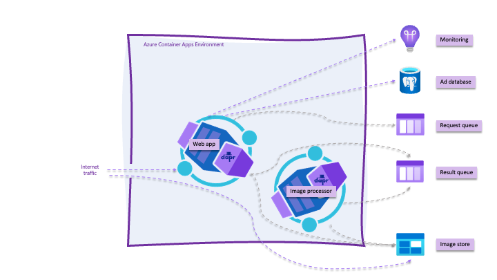

Internet traffic can only access the web application. The image processor API is not exposed to the internet.
The Azure Database for PostgreSQL Flexible server is injected into the same virtual network that hosts the Azure Container App
environment and is also not exposed to the internet. The Azure blob storage container that hosts the images is exposed to the internet
since the images must be accessible by a browser.

## Setup

1. Use the Azure CLI to create an Azure Service Principal, then store that principal's JSON output to a GitHub secret so the GitHub Actions CI/CD process can log into your Azure subscription and deploy the code.
2. Edit the `deploy.yml` workflow file and push the changes into a new `deploy` branch, triggering GitHub Actions to build the .NET projects into containers and push those containers into a new Azure Container Apps Environment.

### Authenticate to Azure and configure the repository with a secret

1. Fork this repository to your own GitHub organization.
2. Create an Azure Service Principal [using the Azure CLI](https://docs.microsoft.com/en-us/azure/developer/github/connect-from-azure?tabs=azure-portal%2Clinux#use-the-azure-login-action-with-a-service-principal-secret).

   ```bash
   az login
   subscription_id=$(az account show --query id --output tsv)
   az ad sp create-for-rbac --sdk-auth --name ContosoAds-CICD --role contributor --scopes "/subscriptions/$subscription_id"
   ```

   > The output of that last command will include a deprecation warning for the `-sdk-auth`
   > flag. This is expected at the time of writing using Azure CLI 2.40. 

3. Copy the JSON written to the screen to your clipboard.

   ```json
   {
     "clientId": "...",
     "clientSecret": "...",
     "subscriptionId": "...",
     "tenantId": "...",
     "activeDirectoryEndpointUrl": "https://login.microsoftonline.com/",
     "resourceManagerEndpointUrl": "https://brazilus.management.azure.com",
     "activeDirectoryGraphResourceId": "https://graph.windows.net/",
     "sqlManagementEndpointUrl": "https://management.core.windows.net:8443/",
     "galleryEndpointUrl": "https://gallery.azure.com",
     "managementEndpointUrl": "https://management.core.windows.net"
   }
   ```

4. Create a new GitHub secret in your fork of this repository named `AZURE_SPN`. Paste the JSON returned from the Azure CLI into this new secret. Once you've done this you'll see the secret in your fork of the repository.
   > Note: Never save the JSON to disk, for it will enable anyone who obtains this JSON code to create or edit resources in your Azure subscription.

5. Create a new GitHub secret in your fork of this repository named `DB_PWD` and set it to a secure password to be used for PostgreSQL.

   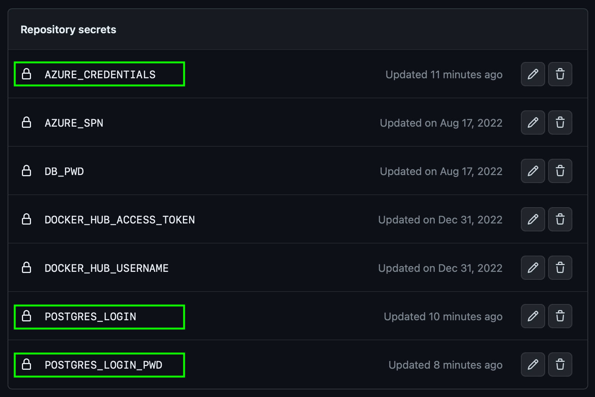

### Deploy the code using GitHub Actions

The easiest way to deploy the code is to make a commit directly to the `deploy` branch. Do this by navigating to the `deploy.yml` file in your browser and 
clicking the `Edit` button.

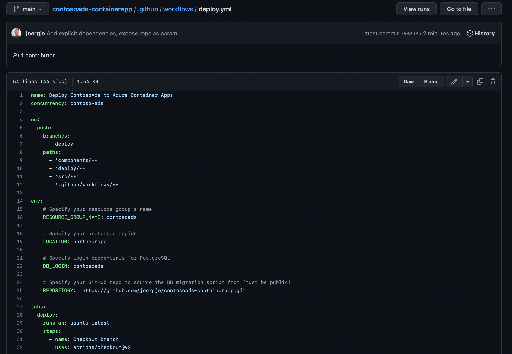

Provide a custom resource group name for the app, set the name of your GitHub repository and then commit the change to a new branch named `deploy`.
If you want to deploy to a different region, make sure to pick one that [offers Azure Container Apps, Azure Database for PostgreSQL Flexible Server 
and Application Insights](https://azure.microsoft.com/en-us/explore/global-infrastructure/products-by-region/?products=monitor,postgresql,container-apps).


Once you click the `Propose changes` button, you'll be in "create a pull request" mode. Don't worry about creating the pull request yet, just click on the `Actions` tab, and you'll see that the deployment CI/CD process has already started.

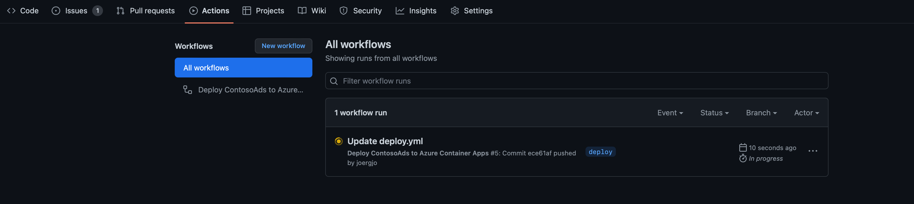

When you click into the workflow, you'll see the `deploy` job the CI/CD will run through:

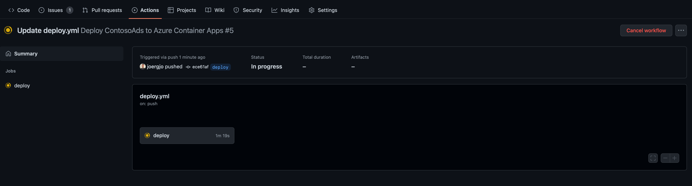

After a few minutes, the workflow will be completed and the workflow diagram will reflect success. If anything fails, you can click into the 
individual process step to see the detailed log output.

> Note: if you do see any failures or issues, please submit an Issue so we can update the sample. Likewise, if you have ideas that could make 
> it better, feel free to submit a pull request.

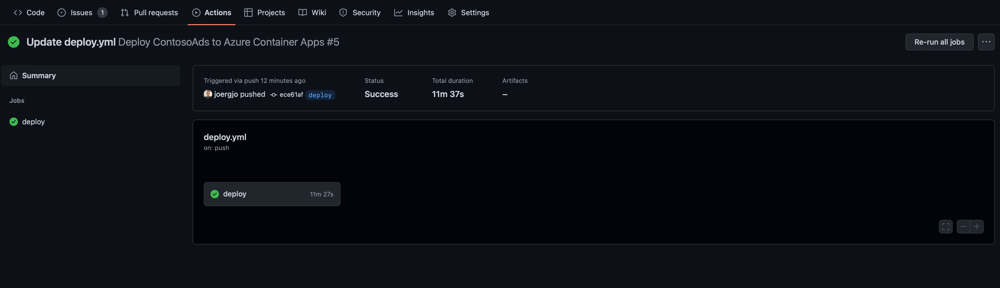

With the projects deployed to Azure, you can now test the app to make sure it works.


## Try the app in Azure

The `deploy` CI/CD process creates a series of resources in your Azure subscription. These are used primarily for
hosting the project code, but there are also additional resources that aid with monitoring and observing how the
app is running in the cloud environment.

| Resource                               | Resource Type                                      | Purpose                                                                                                                                          |
|----------------------------------------|----------------------------------------------------|--------------------------------------------------------------------------------------------------------------------------------------------------|
| contosoads-web                         | An Azure Container App for the web app             | The web app is the Contoso Ads' web frontend where you can create, edit, and delete ads.                                                         |
| contosoads-imageprocessor              | An Azure Container App for the image processor API | This API reads requests from a queue to render images stored in blob storage and creates thumbnail versions of these images.                     |
| contosoads-env                         | An Azure Container Apps environment                | This environment serves as the logical container for all of the instances of all of the container apps comprising the app.                       |
| contosoads-insights                    | Application Insights                               | This provides traces, logs, and metrics to troubleshoot the application.                                                                         |
| contosoads-logs                        | Log Analytics workspace                            | This is the data sink for Application Insights and log output captured by the application containers.                                            |
| contosoads-vnet                        | Virtual network                                    | The Container Apps environment, the PostgreSQL server, and the Container Instance are all connected through this network using different subnets. |
| contosoads.postgres.database.azure.com | Azure Private DNS zone                             | Provides name resolution for our private hosted PostgreSQL server.                                                                               |
| contodoads<random_string>              | Azure storage account                              | Provides both the blob storage and the storage queues.                                                                                           |
| server<random_string>                  | Azure Database for PostgreSQL Flexible Server      | Hosts the application's database and ASP.NET Core data protection keys.                                                                          |                                                                    |
| dbmigration                            | Azure Container Instance                           | This runs the database migration script to prepare the database during deployment.                                                               |                                                                    |

The resources are shown here in the Azure portal:

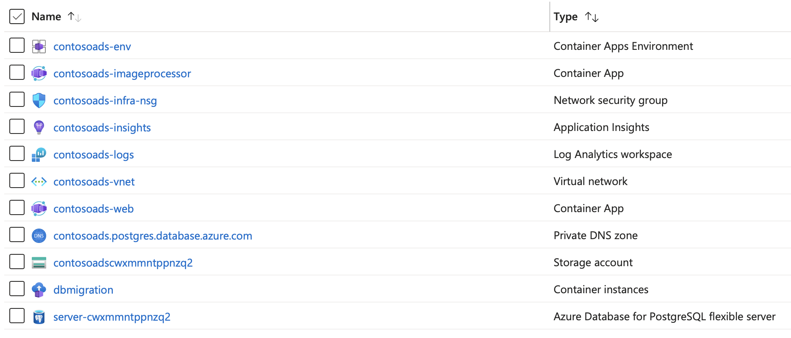

Click on the `contosoads-web` container app to open it up in the Azure portal. In the `Overview` tab you'll see a URL.

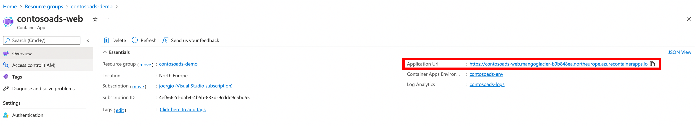

Clicking that URL will open the app's frontend up in the browser.

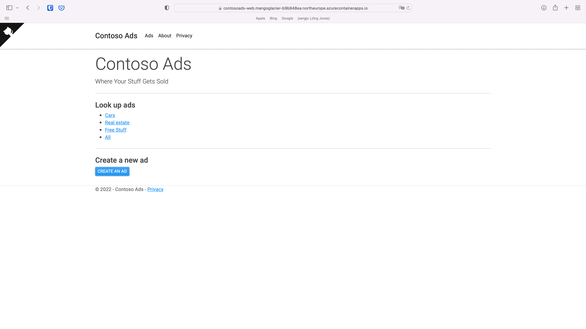

Click the `CREATE AN AD` button and create your first ad.

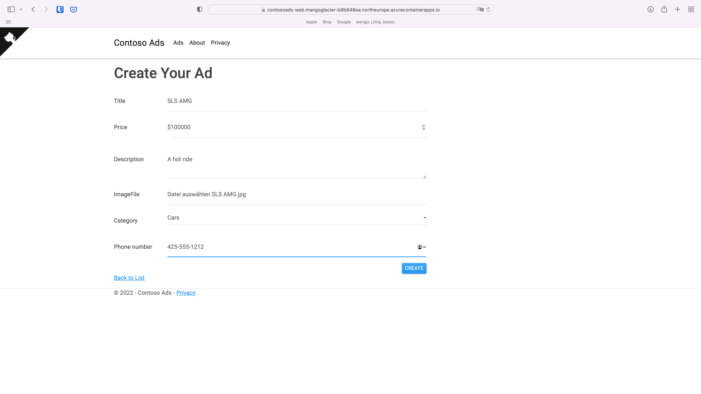

After creating an ad, the web app will navigate back to the list view. No thumbnail is shown yet.

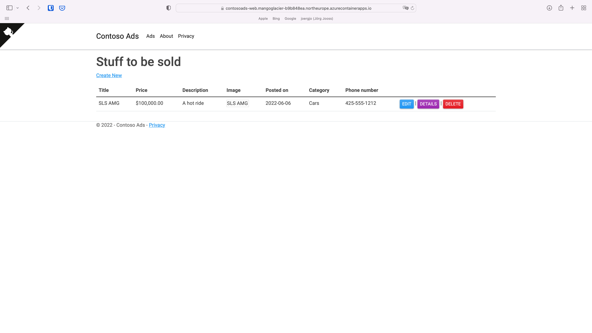

After a few seconds, refresh the page in the web browser. The image processor has created
the thumbnail and it is displayed.

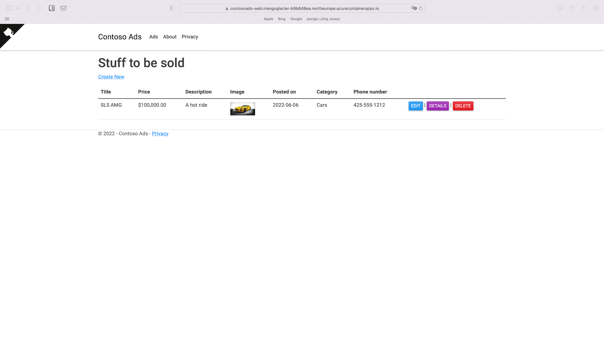

## Additional options

These steps are optional and not required to deploy the application to Azure. Use them to learn 
about building and running the application on your local machine and alternate deployment techniques.

### Building and running the sample app on your PC or Mac with your favorite IDE or just the .NET SDK

See [this document](docs/build-and-run.md) for instructions on how to build and run the sample app on your PC or Mac. 

### Running the sample app on your PC or Mac using Docker Desktop

See [this document](docs/docker.md) for instructions on how to run the sample app on your PC or Mac using Docker.

### Deploying the sample app from the command line

See [this document](docs/deploy-with-cli.md) for instructions on how to deploy the sample app from the command line
instead of using GitHub Actions.
