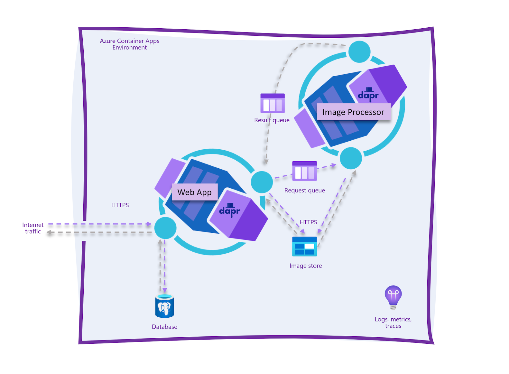
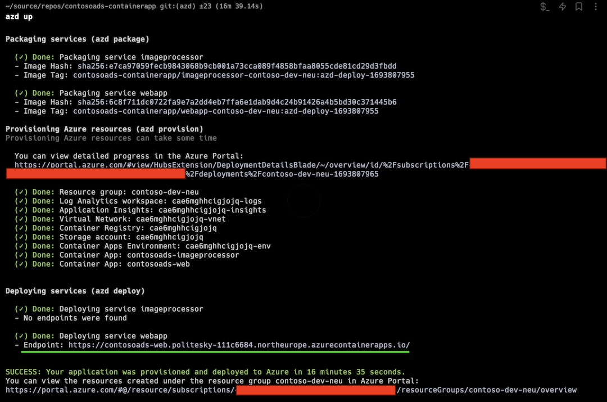
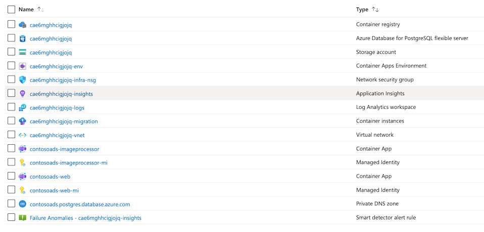
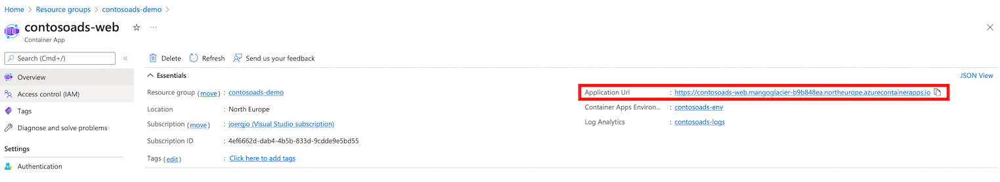

# Contoso Ads on Containers

## Introduction
This sample demonstrates how ASP.NET Core 9.0 can be used to build a cloud native application 
that consists of a frontend web app and an API that communicate asynchronously via messaged 
queues. Messaging between frontend and API is implemented using Dapr and both frontend and API 
are hosted in Azure Container Apps.

## About
Contoso Ads on Containers is a modernized version of the original Contoso Ads sample app for 
[Azure Cloud Services](https://docs.microsoft.com/en-us/azure/cloud-services/cloud-services-dotnet-get-started) and 
[Azure WebJobs](https://docs.microsoft.com/en-us/azure/app-service-web/websites-dotnet-webjobs-sdk-get-started) built
from scratch for Azure Container Apps.

The repository consists of the following projects and folders:

* [src/ContosoAds.Web](src/ContosoAds.Web) - Contoso Ads ASP.NET Core Razor Pages web frontend. The UI shows a list of ads, and allows users to post, edit, and delete ads
* [test/ContosoAds.Web.UnitTests](test/ContosoAds.Web.UnitTests) - Unit tests for the web application that focus on testing the core application logic
* [test/ContosoAds.Web.IntegrationTests](test/ContosoAds.Web.IntegrationTests) - Integration tests for the web application that focus on testing the HTTP request/response interaction
* [src/ContosoAds.ImageProcessor](src/ContosoAds.ImageProcessor) Image Processor API - ASP.NET Core Minimal API that renders thumbnail images for uploaded images 
* [test/ContosoAds.ImageProcessor.UnitTests](test/ContosoAds.ImageProcessor.UnitTests) - Unit tests for the image processor API that focus on testing the core application logic
* [test/ContosoAds.ImageProcessor.IntegrationTests](test/ContosoAds.ImageProcessor.IntegrationTests) - Integration tests for the image processor API that focus on testing the HTTP request/response interaction
* [components](components) - Dapr component files
* [infra](infra) - Azure Bicep templates
* [deploy](deploy) - Additional files used for app deployment
* [.github/workflows](.github/workflows) - GitHub Actions workflows
* [docs](docs) - Additional documentation 

## What you'll learn

This sample app uses a variety of technologies:

* [Azure Container Apps](https://docs.microsoft.com/azure/container-apps/overview)
* [Azure Database for PostgreSQL Flexible Server](https://docs.microsoft.com/en-us/azure/postgresql/flexible-server/)
* [Azure Storage](https://docs.microsoft.com/en-us/azure/storage/blobs/)
* [Azure Container Instances](https://docs.microsoft.com/en-us/azure/container-instances/) 
* [Azure Application Insights](https://docs.microsoft.com/en-us/azure/azure-monitor/app/app-insights-overview)
* [Azure Bicep](https://docs.microsoft.com/azure/azure-resource-manager/bicep/overview?tabs=**bicep**)
* [ASP.NET Core Razor Pages](https://learn.microsoft.com/en-us/aspnet/core/razor-pages/?view=aspnetcore-8.0&tabs=visual-studio-code)
* [ASP.NET Core Minimal API](https://learn.microsoft.com/en-us/aspnet/core/fundamentals/minimal-apis?view=aspnetcore-8.0)
* [Entity Framework Core 9.0](https://learn.microsoft.com/en-us/ef/core/)
* [Dapr](https://dapr.io)
* [C# 13](https://learn.microsoft.com/en-us/dotnet/csharp/whats-new/csharp-13)

## Prerequisites
You'll need a very small set of tools and skills to get started:

* macOS, Linux, or Windows 10/11 
* The [Azure Developer CLI](https://learn.microsoft.com/en-us/azure/developer/azure-developer-cli/overview)
* The [Azure CLI](https://learn.microsoft.com/en-us/cli/azure/install-azure-cli)
* [Docker Desktop](https://docs.docker.com/docker-desktop/install/)
* A [Microsoft Azure subscription](https://azure.microsoft.com/en-us/free)
* [OpenSSL](https://www.openssl.org) (optional, used to generate a secure password)

You can sign up for a Microsoft Azure subscription for free [here](https://azure.microsoft.com/free/).

## Topology diagram

Contoso Ads consist of two Azure Container Apps that are running in the same Container App environment. The web application 
allows you to create, edit and delete ads and optionally upload an image for an ad. All uploaded images are
stored on Azure blob storage using a [Dapr output binding](https://docs.dapr.io/developing-applications/building-blocks/bindings/bindings-overview/).
For every uploaded image, a request is queued up to an image processor API to render a thumbnail image. Messaging between 
the web app and the image processor utilizes Azure storage queues and Dapr input/output bindings. Ads are stored in a 
PostgreSQL database accessed through Entity Framework Core.



The web application is accessible from the Internet, while the image processor API is only accessible from within
the Container App environment.

The Azure Database for PostgreSQL Flexible server is injected into the same virtual network that hosts the Azure Container App
environment and is therefore not exposed to the internet. The Azure blob storage container that hosts the images is exposed to the internet
since the images must be accessible by a browser. 

An Azure Container Instance (not depicted) injected in the virtual network is used to run database migrations.

## Setup

Contoso Ads on Containers can be deployed using the Azure Developer CLI to provision the required Azure services and
to deploy the application in a few simple steps.

`azd` will prompt you to select an Azure subscription, an environment name (e.g., `contosoads-demo`) and an Azure region when 
deploying the app for the first time.

Run the following commands in your preferred
shell (e.g., zsh, bash, PowerShell, &hellip;). Login to Azure CLI and Azure Developer CLI 
using the same user account.

```bash
# Log in to Azure CLI (only required before first use)
az auth login

# Log in to Azure Developer CLI (only required before first use)
azd auth login

# Set a Postgres admin login and password
azd env set POSTGRES_LOGIN contosoads

# If you don't have OpenSSL installed or don't want to use a 
# a random password, set POSTGRES_LOGIN_PASSWORD to a secure 
# password of your choice
azd env set POSTGRES_LOGIN_PASSWORD "$(openssl rand -base64 32 | tr -dc 'A-Za-z0-9' | head -c 24)"

# Provision the infrastructure, build and deploy the application's container images
azd up
```

If the deployment succeeds, you should see output similar to the following screenshot. Copy
and paste the FQDN displayed for the `webapp` service to your browser and start using
the app!



## Using the app in Azure

The Bicep templates used by `azd` create a series of resources in your Azure subscription. These are used primarily for
hosting the application and its database, but there are also additional resources that aid with monitoring and observing how the
app is running in the cloud environment.

| Resource                               | Resource Type                                      | Purpose                                                                                                                                           |
|----------------------------------------|----------------------------------------------------|---------------------------------------------------------------------------------------------------------------------------------------------------|
| contosoads-web                         | An Azure Container App for the web app             | The web app is the Contoso Ads' web frontend where you can create, edit, and delete ads.                                                          |
| contosoads-imageprocessor              | An Azure Container App for the image processor API | This API reads requests from a queue to render images stored in blob storage and creates thumbnail versions of these images.                      |
| ca<random_string>-env                  | An Azure Container Apps environment                | This environment serves as the logical container for all of the instances of all of the container apps comprising the app.                        |
| ca<random_string>-insights             | Application Insights                               | This provides traces, logs, and metrics to troubleshoot the application.                                                                          |
| ca<random_string>-logs                 | Log Analytics workspace                            | This is the data sink for Application Insights and log output captured by the application containers.                                             |
| ca<random_string>-vnet                 | Virtual network                                    | The Container Apps environment, the PostgreSQL server, and the Container Instance are all connected through this network using different subnets. |
| ca<random_string>-infra-nsg            | Network security group                             | A set of network rules that are applied to the Container App's subnet.                                                                            |
| contosoads.postgres.database.azure.com | Azure Private DNS zone                             | Provides name resolution for the privately hosted PostgreSQL server.                                                                              |
| ca<random_string>                      | Azure Storage account                              | Provides both the blob storage and the storage queues.                                                                                            |
| ca<random_string>                      | Azure Database for PostgreSQL Flexible Server      | Hosts the application's database and ASP.NET Core data protection keys.                                                                           |                                                                    |
| ca<random_string>                      | Azure Container Registry                           | Stores container images built using `azd up` and `azd deploy`.                                                                                    |                                                                    |
| ca<random_string>-migration            | Azure Container Instance                           | This runs the database migration script to prepare the database during deployment.                                                                |                                                                    |

The resources are shown here in the Azure portal:



Click on the `contosoads-web` container app to open it up in the Azure portal. In the `Overview` tab you'll see a URL.



Clicking that URL will open the app's frontend up in the browser. It's the
same URL that is displayed after running `azd up` or `azd deploy`.


Click the `CREATE AN AD` button and create your first ad.


After creating an ad, the web app will navigate back to the list view. No thumbnail is shown yet.


After a few seconds, once the image processor has created the the thumbnail, the web
page will refresh itself display and the thumbnail.


## Hacking on the sample app

If you want to change the sample app's source code and run these changes in Azure, you will need 
to install additional tools:

* [.NET 8.0 SDK](https://dotnet.microsoft.com/en-us/download/dotnet/8.0)
* [Dapr](https://docs.dapr.io/getting-started/install-dapr-cli/)
* (Optional, but recommended) An IDE or code editor (e.g., [Visual Studio](https://visualstudio.microsoft.com/vs/), [Visual Studio Code](https://code.visualstudio.com), [Rider](https://www.jetbrains.com/rider/))

The Azure Developer CLI makes it easy to change the sample and deploy it to Azure. After updating
the application's source code, run

```bash
azd deploy
```

to build container images, upload them to your deployment's Azure Container Registry, and
deploy them as new [Container App revisions](https://learn.microsoft.com/en-us/azure/container-apps/revisions). 

See [Building and running the sample app using the .NET SDK and Dapr](#building-and-running-the-sample-app-using-the-net-sdk-and-dapr)
for additional information how to develop the sample app. 

## Additional options

These steps are optional and not required to deploy the application to Azure. Use them to learn 
about building and running the application on your local machine and alternate deployment techniques.

### Building and running the sample app using the .NET SDK and Dapr

See [this document](docs/build-and-run.md) for instructions on how to build and run the sample app on your PC or Mac using
the .NET SDK and the Dapr CLI. 

### Running the sample app on your PC or Mac using Docker Desktop

See [this document](docs/docker.md) for instructions on how to run the sample app on your PC or Mac using Docker.

### Deploying the sample app using GitHub Actions workflows

See [this document](docs/github-actions-workflow.md) for instructions on how 
to set up a GitHub Actions workflow to deploy the sample app.
