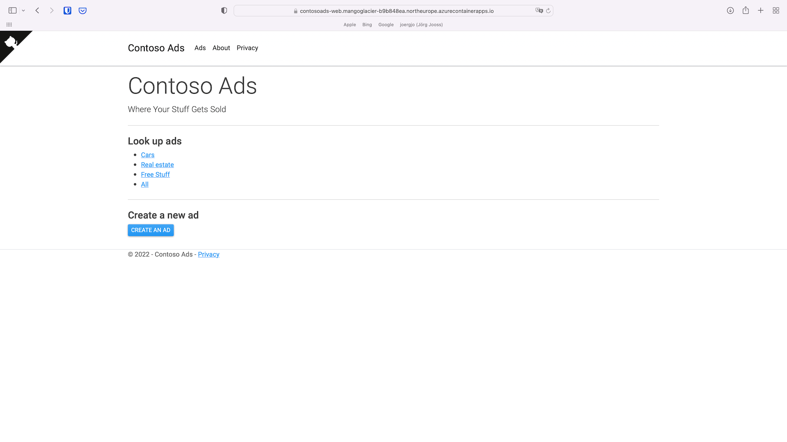

# Contoso Ads on Containers

## Introduction
This sample demonstrates how ASP.NET Core 6.0 is used to build a cloud-native application 
that consists of a frontend web app and an API that communicate asynchronously via messaged 
queues. The messaging is implemented using Dapr and both frontend and API are hosted in Azure Container Apps.

## About
Contoso Ads on Containers is a modernized version of the original Contoso Ads sample app for 
[Azure Cloud Services](https://docs.microsoft.com/en-us/azure/cloud-services/cloud-services-dotnet-get-started) and 
[Azure WebJobs](https://docs.microsoft.com/en-us/azure/app-service-web/websites-dotnet-webjobs-sdk-get-started) built
from scratch for Azure Container Apps.

The repository consists of the following projects and folders:

* [src/ContosoAds.Web](src/ContosoAds.Web) - Contoso Ads ASP.NET Core Razor Pages web frontend. The UI shows a list of ads, and allows users to post, edit, and delete ads.
* [test/ContosoAds.Web.UnitTests](test/ContosoAds.Web.UnitTests) - Unit tests for the web application that focus on testing the core application logic.
* [test/ContosoAds.Web.IntegrationTests](test/ContosoAds.Web.IntegrationTests) - Integration tests for the web application that focus on testing the HTTP request/response interaction.
* [src/ContosoAds.ImageProcessor](src/ContosoAds.ImageProcessor) Image Processor API - ASP.NET Core Minimal API that renders thumbnail images for uploaded images 
* [test/ContosoAds.ImageProcessor.UnitTests](test/ContosoAds.ImageProcessor.UnitTests) - Unit tests for the image processor API that focus on testing the core application logic.
* [test/ContosoAds.ImageProcessor.IntegrationTests](test/ContosoAds.ImageProcessor.IntegrationTests) - Integration tests for the image processor API that focus on testing the HTTP request/response interaction.
* [components](components) - Dapr component files.
* [deploy](deploy) - Deployment scripts and Azure Bicep templates.

## What you'll learn

This sample app uses a variety of technologies:

* [Azure Container Apps](https://docs.microsoft.com/azure/container-apps/overview)
* [Azure Database for PostgreSQL Flexible Server](https://docs.microsoft.com/en-us/azure/postgresql/flexible-server/)
* [Azure Storage](https://docs.microsoft.com/en-us/azure/storage/blobs/)
* [Azure Container Instances](https://docs.microsoft.com/en-us/azure/container-instances/) 
* [Azure Application Insights](https://docs.microsoft.com/en-us/azure/azure-monitor/app/app-insights-overview)
* [Azure Bicep](https://docs.microsoft.com/azure/azure-resource-manager/bicep/overview?tabs=**bicep**)
* [ASP.NET Core Razor Pages 6.0](https://docs.microsoft.com/en-us/aspnet/core/razor-pages/?view=aspnetcore-6.0&tabs=visual-studio-code)
* [ASP.NET Core Minimal API](https://docs.microsoft.com/en-us/aspnet/core/fundamentals/minimal-apis?view=aspnetcore-6.0)
* [Entity Framework Core 6.0](https://docs.microsoft.com/en-us/ef/core/overview)
* [Dapr](https://dapr.io)
* [C# 10](https://docs.microsoft.com/en-us/dotnet/csharp/whats-new/csharp-10) 


## Prequisites
You'll need an Azure subscription and a very small set of tools and skills to get started:

1. An Azure subscription. Sign up [for free](https://azure.microsoft.com/free/).
2. Either the [Azure CLI](https://docs.microsoft.com/cli/azure/install-azure-cli) installed locally, or the [Azure Cloud Shell](https://shell.azure.com) available online.
3. If you are using a local installation of the Azure CLI: 
   1. You need a bash shell to execute the included deployment script - on Windows 10/11 use the [Window Subsystem for Linux](https://docs.microsoft.com/en-us/windows/wsl/install).
   2. Make sure to have Bicep CLI installed by running `az bicep install`

## Topology diagram

Contoso Ads consist of two Azure Container Apps that are running in the same Container App environment. The web application 
allows you to create, edit and delete ads and optionally upload an image for an ad. All uploaded images are
stored on Azure blob storage using a [Dapr output binding](https://docs.dapr.io/developing-applications/building-blocks/bindings/bindings-overview/).
For every uploaded image, a request is queued up to an image processor API to render a thumbnail image. Messaging between 
the web app and the image processor utilizes Azure storage queues and Dapr input/output bindings. Ads are stored in a 
PostgreSQL database.


Internet traffic can only access the web application. The image processor API is not exposed to the internet.
The Azure Database for PostgreSQL Flexible server is injected into the same virtual network that hosts the Azure Container App
environment and is also not exposed to the internet. The Azure blob storage container that hosts the images is exposed to the internet
since the images must be accessible by a browser.

## Setup

By the end of this section you'll have Contoso Ads running in Azure. This setup process requires you to run a 
single deployment script, and should take you around 5-10 minutes.

Before executing the deployment script, you have to export two environment variables: 
* `CONTOSOADS_RESOURCE_GROUP_NAME` must be set to the name of the resource group that hosts all resources for the sample app. 
The script will also create the resource group itself.
* `CONTOSOADS_DB_PWD` must be set to the password for the database user used by the application to access PostgreSQL. 

Then, navigate tp the `deploy` directory and run `deplpy.sh`:

```bash
cd contosoads-containerapp/deploy
export CONTOSOADS_RESOURCE_GROUP_NAME=<your-resource-group-name>
export CONTOSOADS_DB_PWD=$(uuidgen)
./deploy.sh
```

All resources are created in the same region. You can override the default settings
of the deployment script by exporting the following environment variables:

| Environment variable            | Purpose                                    | Default value |
|---------------------------------|--------------------------------------------|---------------|
| `CONTOSOADS_LOCATION`           | Azure region to deploy to                  | `westeurope`  |
| `CONTOSOADS_BASE_NAME`          | Common name prefix for Azure resources     | `contosoads`  |
| `CONTOSOADS_WEBAPP_TAG`         | Web app container image tag                | `stable`      |
| `CONTOSOADS_IMAGEPROCESSOR_TAG` | Image processor container image tag        | `stable`      |
| `CONTOSOADS_POSTGRES_VERSION`   | PostgreSQL version to use (12, 13, or 14)  | `13`          |

The deployment script will create the following resources:

| Resource                               | Resource Type                                      | Purpose                                                                                                                                          |
|----------------------------------------|----------------------------------------------------|--------------------------------------------------------------------------------------------------------------------------------------------------|
| contosoads-web                         | An Azure Container App for the web app             | The web app is the Contoso Ads' web frontend where you can create, edit, and delete ads.                                                         |
| contosoads-imageprocessor              | An Azure Container App for the image processor API | This API reads requests from a queue to render images stored in blob storage and creates thumbnail versions of these images.                     |
| contosoads-env                         | An Azure Container Apps environment                | This environment serves as the logical container for all of the instances of all of the container apps comprising the app.                       |
| contosoads-insights                    | Application Insights                               | This provides traces, logs, and metrics to troubleshoot the application.                                                                         |
| contosoads-logs                        | Log Analytics workspace                            | This is the data sink for Application Insights and log output captured by the application containers.                                            |
| contosoads-vnet                        | Virtual network                                    | The Container Apps environment, the PostgreSQL server, and the Container Instance are all connected through this network using different subnets. |
| contosoads.postgres.database.azure.com | Azure Private DNS zone                             | Provides name resolution for our private hosted PostgreSQL server.                                                                               |
| contodoads<random_string>              | Azure storage account                              | Provides both the blob storage and the storage queues.                                                                                           |
| server<random_string>                  | Azure Database for PostgreSQL Flexible Server      | Hosts the application's database and ASP.NET Core data protection keys.                                                                          |                                                                    |
| dbmigration                            | Azure Container Instance                           | This runs the database migration script to prepare the database during deployment.                                                               |                                                                    |

> All names starting with `contosoads` depend on how `CONTOSOADS_BASE_NAME` is set.

The resources are shown here in the Azure portal:


With the projects deployed to Azure, you can now test the app to make sure it works.

## Try the app in Azure

Click on the `contosoads-web` container app to open it up in the Azure portal. In the `Overview` tab you'll see a URL.


The deployment script also displays the URL as its final output:


Clicking that URL will open the app's frontend up in the browser.



Click the `CREATE AN AD` button and create your first ad.


After creating an ad, the web app will navigate back to the list view. No thumbnail is shown yet.


After a few seconds, refresh the page in the web browser. The image processor has created
the thumbnail and it is displayed.


## Additional options

These steps are optional and not required to deploy the application to Azure,
but recommended for learning how to build and run the application before deploying it to Azure.

### Building and running the sample app on your PC or Mac with your IDE or the .NET SDK

See [this document](docs/build-and-run.md) for instructions on how to build and run the sample app on your PC or Mac. 

### Running the sample app on your PC or Mac using Docker

See [this document](docs/docker.md) for instructions on how to run the sample app on your PC or Mac using Docker.

