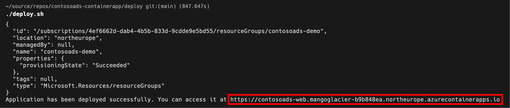

# Deploying from the command line 

As an alternative to deploying with GitHub Actions, you can use the included
deployment script to deploy the Contoso Ads sample app. This gives you
a bit more flexibility for naming resources and selecting specific container
images.

## Prerequisites

You'll need an Azure subscription and a very small set of tools and skills to get started:

1. An Azure subscription. Sign up [for free](https://azure.microsoft.com/free/).
2. Either the [Azure CLI](https://docs.microsoft.com/cli/azure/install-azure-cli) installed locally, or the [Azure Cloud Shell](https://shell.azure.com) available online.
3. If you are using a local installation of the Azure CLI:
  1. You need a bash shell to execute the included deployment script - on Windows 10/11 use the [Window Subsystem for Linux](https://docs.microsoft.com/en-us/windows/wsl/install).
  2. Make sure to have Bicep CLI installed by running `az bicep install`

## Setup

By the end of this section you'll have Contoso Ads running in Azure. This setup process requires you to run a
single deployment script, and should take you around 5-10 minutes.

Before executing the deployment script, you have to export two environment variables:
* `CONTOSOADS_RESOURCE_GROUP` must be set to the name of the resource group that hosts all resources for the sample app.
  The script will also create the resource group itself.
* `CONTOSOADS_DB_PWD` must be set to the password for the database user used by the application to access PostgreSQL.
* `CONTOSOADS_REPO` must be set to your GitHub repo's URL (i.e., the URL of your clone of this repo).
Then, navigate tp the `deploy` directory and run `deploy.sh`:

```bash
cd contosoads-containerapp/deploy
export CONTOSOADS_RESOURCE_GROUP=<your-resource-group-name>
export CONTOSOADS_DB_PWD=$(openssl rand -hex 20)
export CONTOSOADS_REPO=<your-github-repo-url>
./deploy.sh
```

All resources are created in the same region. You can override the default settings
of the deployment script by exporting the following environment variables:

| Environment variable            | Purpose                                    | Default value |
|---------------------------------|--------------------------------------------|---------------|
| `CONTOSOADS_LOCATION`           | Azure region to deploy to                  | `westeurope`  |
| `CONTOSOADS_BASE_NAME`          | Common name prefix for Azure resources     | `contosoads`  |
| `CONTOSOADS_WEBAPP_TAG`         | Web app container image tag                | `stable`      |
| `CONTOSOADS_IMAGEPROCESSOR_TAG` | Image processor container image tag        | `stable`      |
| `CONTOSOADS_POSTGRES_VERSION`   | PostgreSQL version to use (12, 13, or 14)  | `13`          |

The deployment script will create the following resources:

| Resource                               | Resource Type                                      | Purpose                                                                                                                                          |
|----------------------------------------|----------------------------------------------------|--------------------------------------------------------------------------------------------------------------------------------------------------|
| contosoads-web                         | An Azure Container App for the web app             | The web app is the Contoso Ads' web frontend where you can create, edit, and delete ads.                                                         |
| contosoads-imageprocessor              | An Azure Container App for the image processor API | This API reads requests from a queue to render images stored in blob storage and creates thumbnail versions of these images.                     |
| contosoads-env                         | An Azure Container Apps environment                | This environment serves as the logical container for all of the instances of all of the container apps comprising the app.                       |
| contosoads-insights                    | Application Insights                               | This provides traces, logs, and metrics to troubleshoot the application.                                                                         |
| contosoads-logs                        | Log Analytics workspace                            | This is the data sink for Application Insights and log output captured by the application containers.                                            |
| contosoads-vnet                        | Virtual network                                    | The Container Apps environment, the PostgreSQL server, and the Container Instance are all connected through this network using different subnets. |
| contosoads.postgres.database.azure.com | Azure Private DNS zone                             | Provides name resolution for our private hosted PostgreSQL server.                                                                               |
| contodoads<random_string>              | Azure storage account                              | Provides both the blob storage and the storage queues.                                                                                           |
| server<random_string>                  | Azure Database for PostgreSQL Flexible Server      | Hosts the application's database and ASP.NET Core data protection keys.                                                                          |                                                                    |
| dbmigration                            | Azure Container Instance                           | This runs the database migration script to prepare the database during deployment.                                                               |                                                                    |

> All names starting with `contosoads` depend on how `CONTOSOADS_BASE_NAME` is set.

The deployment script displays the URL as its final output:



