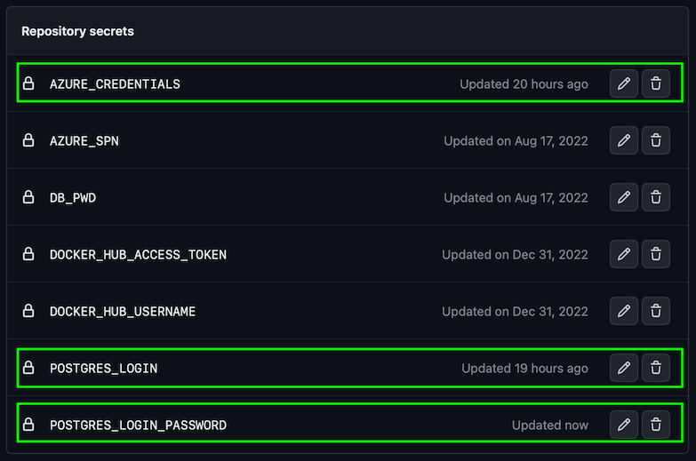

# Setting up a GitHub Actions workflow

## Prerequisites

* [Azure CLI](https://docs.microsoft.com/cli/azure/install-azure-cli) 
* A [GitHub account](https://github.com/join) 

You can either install the Azure CLI locally, or use it through the 
[Azure Cloud Shell](https://shell.azure.com).

## Setup

1. Use the Azure CLI to create an Azure Service Principal, then store that principal's JSON output to a GitHub secret so the GitHub Actions CI/CD process can log into your Azure subscription and deploy the code.
2. Edit the `deploy.yml` workflow file and push the changes into a new `deploy` branch, triggering GitHub Actions to build container images and push those into a new Azure Container Apps Environment.

These steps are describe in more detail in the following sections.

### Authenticate to Azure and configure the repository with a secret

1. Fork this repository to your own GitHub organization.
2. Create an Azure Service Principal [using the Azure CLI](https://docs.microsoft.com/en-us/azure/developer/github/connect-from-azure?tabs=azure-portal%2Clinux#use-the-azure-login-action-with-a-service-principal-secret).

   ```bash
   az login
   
   subscription_id=$(az account show --query id --output tsv)
   az ad sp create-for-rbac \
     --name contosoads-gh \
     --role contributor \
     --json-auth \
     --scopes "/subscriptions/$subscription_id"
   ```

3. Copy the JSON written to the screen to your clipboard.

   ```json
   {
      "clientId": "<GUID>",
      "clientSecret": "<STRING>",
      "subscriptionId": "<GUID>",
      "tenantId": "<GUID>",
      "resourceManagerEndpointUrl": "<URL>"
      (...)
   }
   ```

4. Create a new GitHub secret in your fork of this repository named `AZURE_CREDENTIALS`. Paste the JSON returned from the Azure CLI into this new secret. Once you've done this you'll see the secret in your fork of the repository.
   > Note: Never save the JSON to disk, for it will enable anyone who obtains this file to create or edit resources in your Azure subscription.
5. Create a new GitHub secret named `POSTGRES_LOGIN` and set it to a valid PostgreSQL user name (e.g., `contosoads`).
6. Create a new GitHub secret named `POSTGRES_LOGIN_PWD` and set it to a secure password to be used for `POSTGRES_LOGIN`.

   

7. Create a new GitHub variable named `AZURE_ENV_NAME` and set it to the name of the environment you want to deploy to.
8. Create a new GitHub variable named `AZURE_LOCATION` and set it to the Azure region you want to deploy to (e.g., `northeurope`). Make sure to pick one that [offers Azure Container Apps, Azure Database for PostgreSQL Flexible Server and Application Insights](https://azure.microsoft.com/en-us/explore/global-infrastructure/products-by-region/?products=monitor,postgresql,container-apps).
9. Create a new GitHub variable named `AZURE_SUBSCRIPTION_ID` and set it to the GUID of your Azure subscription.

   

# To be updated
### Deploy the code using GitHub Actions

The easiest way to deploy the application is to manually start using the GitHub actions workflow
named `azure-dev` by clicking `Run workflow` the button.


After a few minutes, the workflow will be completed and the workflow diagram will reflect success. If anything fails, you can click into the
individual process step to see the detailed log output.

> Note: if you do see any failures or issues, please submit an Issue so we can update the sample. Likewise, if you have ideas that could make
> it better, feel free to submit a pull request.


With the projects deployed to Azure, you can now test the app to make sure it works.

